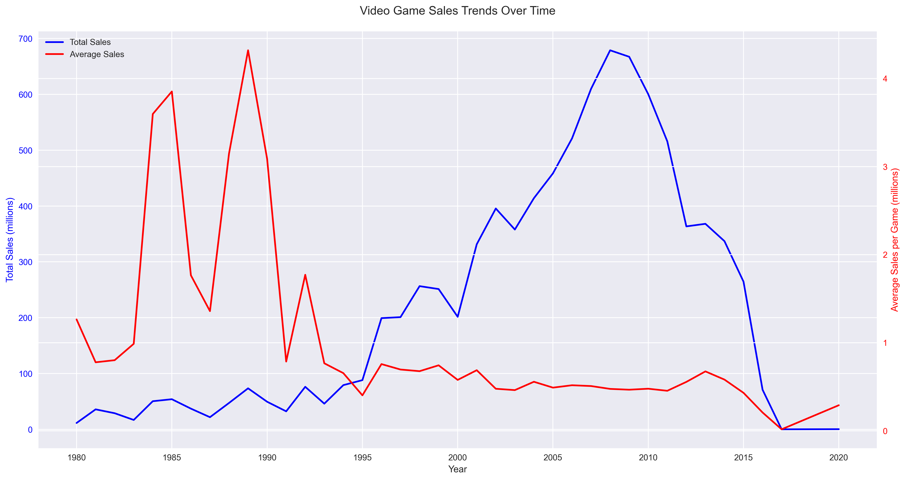
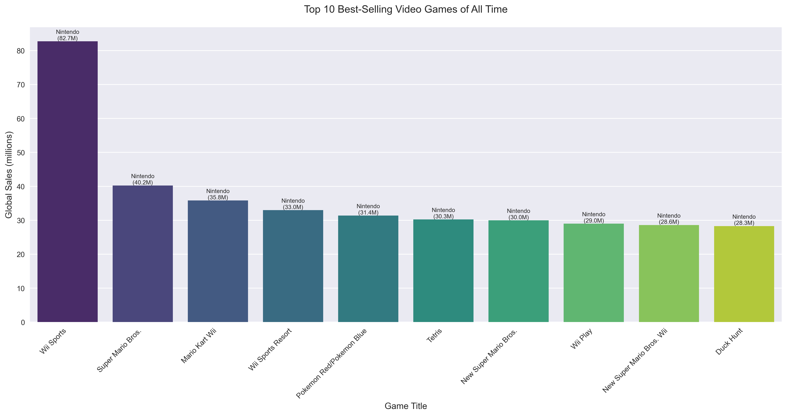
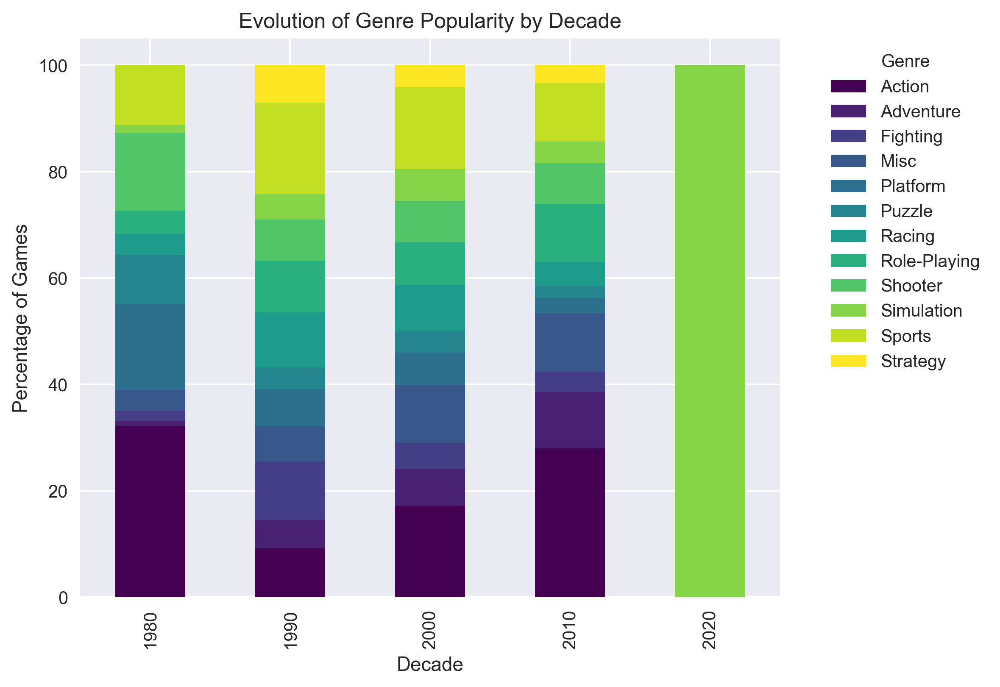
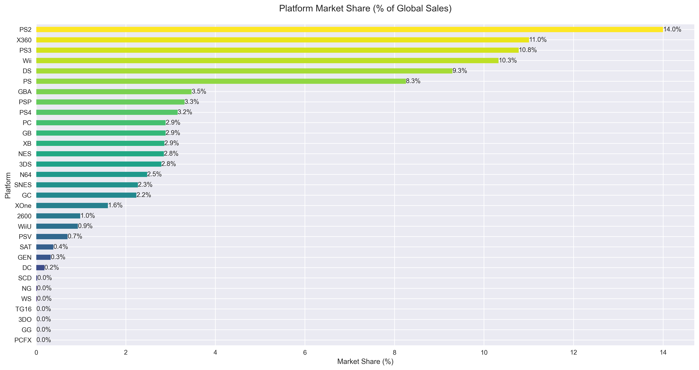
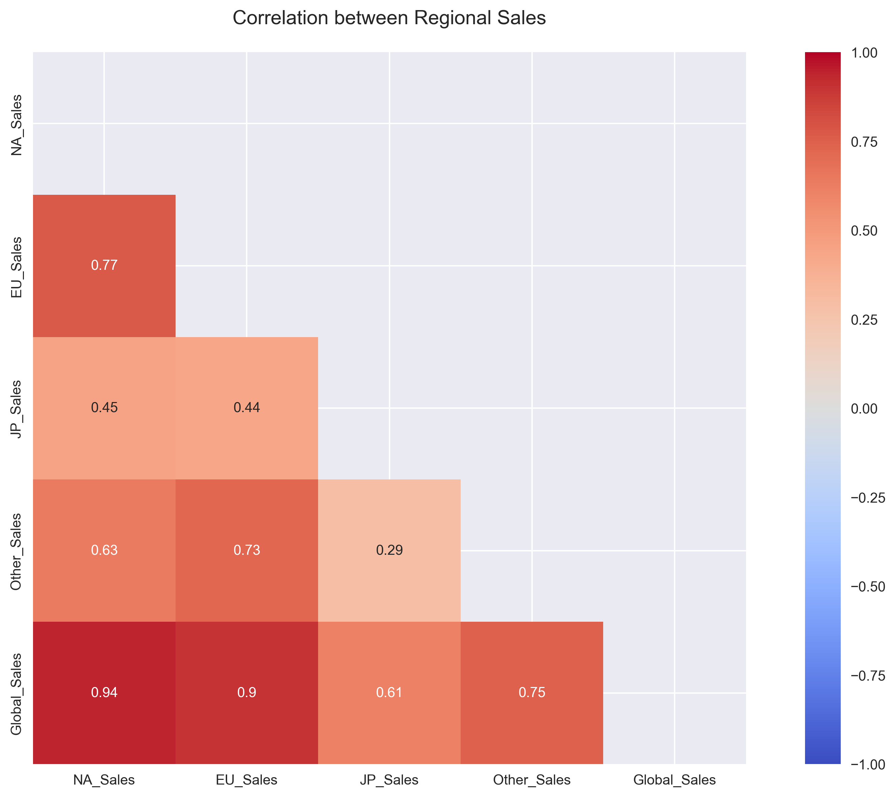
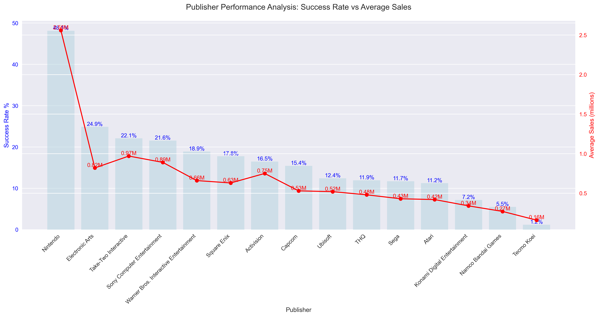

# The Evolution of Video Game Sales: A Four-Decade Analysis (1980-2020)

An in-depth analysis of the video game industry's transformation over 40 years, revealing fascinating patterns in consumer preferences, market dynamics, and industry evolution.

## Executive Summary

My comprehensive analysis of the video game industry from 1980 to 2020 reveals a fascinating journey of growth, transformation, and market dynamics. The dataset encompasses:
- **16,291** unique video games
- **8.8 billion** units in total global sales
- **40 years** of industry evolution
- Average sales of **540,000** units per game

## The Anatomy of Success in Gaming

### Breaking Down the Numbers
- Only **12.5%** of games (2,031 titles) achieve the milestone of 1 million units sold
- An elite **0.4%** (62 games) reach the prestigious 10 million units mark
- The average game sells 540,000 units globally

### The Golden Era: 2006-2010
This period stands out as the industry's most successful, with unprecedented sales figures:

1. **2008**: 678.9M units (1,428 games)
2. **2009**: 667.3M units (1,431 games)
3. **2007**: 609.9M units (1,201 games)
4. **2010**: 600.3M units (1,257 games)
5. **2006**: 521.0M units (1,008 games)

This golden period coincides with several pivotal industry developments:
- The maturation of the 7th generation consoles (PS3, Xbox 360, Wii)
- The explosion of casual gaming through the Nintendo Wii
- The rise of mobile gaming
- The emergence of digital distribution platforms

## Market Evolution Through the Decades

### Genre Evolution
The transformation of dominant genres tells a story of changing player preferences:

#### 1980s Top Genres
1. Platform Games (122.27M units)
2. Puzzle Games (62.73M units)
3. Shooter Games (59.79M units)

*Why?* Early hardware limitations favored simpler gameplay mechanics and clear objectives.

#### 1990s Top Genres
1. Platform Games (208.91M units)
2. Role-Playing Games (184.52M units)
3. Racing Games (150.40M units)

*Why?* Improved technology enabled more complex gameplay and storytelling.

#### 2000s Top Genres
1. Action Games (858.91M units)
2. Sports Games (805.59M units)
3. Misc Games (479.83M units)

*Why?* Better graphics and processing power enabled more realistic and immersive experiences.

#### 2010s Top Genres
1. Action Games (673.46M units)
2. Shooter Games (462.80M units)
3. Sports Games (324.80M units)

*Why?* Online multiplayer capabilities and social gaming drove these genres' popularity.

## Platform Wars and Market Share

### Top 5 Platforms by Total Sales
1. **PlayStation 2**: 1,233.46M units (2000-2011)
2. **Xbox 360**: 969.60M units (2005-2016)
3. **PlayStation 3**: 949.35M units (2006-2016)
4. **Wii**: 909.81M units (2006-2015)
5. **Nintendo DS**: 818.91M units (1985-2020)

### Platform Lifecycle Analysis

Key observations:
- The PS2's dominance (1,233M units) represents the peak of traditional console gaming
- Nintendo DS's remarkable 35-year presence shows the endurance of handheld gaming
- The Wii's success (909M units in 9 years) demonstrates the potential of innovative gaming concepts

## Publisher Performance and Strategy

### Success Factors
My analysis reveals several key factors that contribute to publisher success:

1. **Portfolio Diversity**
   - Successful publishers maintain a mix of reliable franchises and new IPs
   - Balance between high-risk, high-reward titles and steady performers

2. **Market Timing**
   - Launch timing relative to console lifecycles
   - Seasonal release patterns
   - Competition awareness

3. **Regional Strategy**
   - Different markets show distinct preferences
   - Successful publishers adapt their strategies for each region

## Industry Trends and Future Implications

### 1. Market Concentration
- The industry shows strong winner-take-all characteristics
- Success is increasingly concentrated among top publishers
- Blockbuster titles dominate sales

### 2. Platform Dynamics
- Console generations typically last 5-7 years
- Mobile and PC platforms show more stability
- Cross-platform development is increasingly important

### 3. Genre Evolution
- Action and Shooter genres dominate modern gaming
- RPG elements are increasingly incorporated across genres
- Mobile gaming influences casual game development

## Methodology and Data Quality

This analysis was conducted using:
- Python with Pandas for data processing
- Matplotlib and Seaborn for visualization
- Statistical analysis tools for trend identification

### Data Considerations
- Sales figures represent physical units sold
- Digital sales are not fully captured
- Mobile gaming data may be underrepresented

## Conclusions

The video game industry has shown remarkable evolution over four decades, characterized by:
1. Increasing market sophistication
2. Growing importance of technology
3. Shifting consumer preferences
4. Rising development costs and risks

The future appears to be trending toward:
- More digital distribution
- Cross-platform integration
- Games-as-a-service models
- Increased importance of post-launch content

---

*Note: This analysis is based on historical sales data up to 2020 and may not reflect current market trends. Digital distribution and mobile gaming have significantly impacted the industry since then.*
